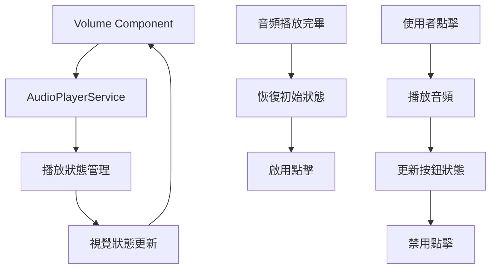

# Design Document

## Overview

本設計文件描述如何改善魚類基本資料頁面中Volume組件的音頻播放視覺回饋。目前的Volume組件缺乏播放狀態指示，導致使用者體驗不佳。設計將整合現有的AudioPlayerService，為Volume組件添加清晰的播放狀態管理和視覺回饋，同時保持簡潔的設計風格。

## Architecture

### 系統架構層次

```
Frontend (Vue.js)
├── Components/
│   ├── Volume.vue (Enhanced)          # 改善後的音頻播放按鈕
│   └── EnhancedVolumeButton.vue       # 新的增強版音頻按鈕組件
├── Services/
│   └── AudioPlayerService.js          # 現有的音頻播放服務
└── Composables/
    └── useAudioPlayback.js            # 新的音頻播放組合式函數
```

### 狀態管理架構



## Components and Interfaces

### 1. Enhanced Volume Component

**設計原則：**

- 保持現有的圓形按鈕設計
- 使用顏色變化和icon替換來指示狀態
- 整合AudioPlayerService進行狀態管理
- 支援錯誤處理和重試機制

**組件結構：**

```vue
<template>
  <span
    :class="[
      'inline-flex items-center justify-center rounded-full ml-2 transition-colors duration-200',
      buttonClasses,
    ]"
    style="width: 2.2rem; height: 2.2rem"
    @click="handleClick"
    :disabled="isPlaying"
    :title="buttonTitle"
  >
    <!-- 播放圖示 (預設狀態) -->
    <svg
      v-if="playbackState === 'idle'"
      class="w-5 h-5 text-gray-600"
      fill="currentColor"
      viewBox="0 0 24 24"
    >
      <path d="M8 5v14l11-7z" />
    </svg>

    <!-- 播放中圖示 -->
    <svg
      v-else-if="playbackState === 'playing'"
      class="w-5 h-5 text-white"
      fill="currentColor"
      viewBox="0 0 24 24"
    >
      <path
        d="M12 2C6.48 2 2 6.48 2 12s4.48 10 10 10 10-4.48 10-10S17.52 2 12 2zm-2 15l-5-5 1.41-1.41L10 14.17l7.59-7.59L19 8l-9 9z"
      />
    </svg>

    <!-- 錯誤圖示 -->
    <svg
      v-else-if="playbackState === 'error'"
      class="w-5 h-5 text-white"
      fill="currentColor"
      viewBox="0 0 24 24"
    >
      <path
        d="M12 2C6.48 2 2 6.48 2 12s4.48 10 10 10 10-4.48 10-10S17.52 2 12 2zm-1 15h2v-2h-2v2zm0-4h2V7h-2v6z"
      />
    </svg>
  </span>
</template>
```

### 2. 狀態管理邏輯

**播放狀態定義：**

```javascript
const PlaybackState = {
  IDLE: 'idle', // 初始狀態，可點擊
  PLAYING: 'playing', // 播放中，不可點擊
  ERROR: 'error', // 錯誤狀態，可點擊重試
}
```

**視覺狀態映射：**

```javascript
const stateStyles = {
  idle: {
    background: 'bg-gray-200 hover:bg-gray-300',
    cursor: 'cursor-pointer',
    disabled: false,
  },
  playing: {
    background: 'bg-blue-500',
    cursor: 'cursor-not-allowed',
    disabled: true,
  },
  error: {
    background: 'bg-red-500 hover:bg-red-600',
    cursor: 'cursor-pointer',
    disabled: false,
  },
}
```

### 3. useAudioPlayback Composable

**功能：**

- 封裝音頻播放邏輯
- 管理播放狀態
- 處理錯誤和重試
- 提供響應式狀態

```javascript
// composables/useAudioPlayback.js
import { ref, computed, onUnmounted } from 'vue'
import audioPlayerService from '../services/AudioPlayerService.js'

export function useAudioPlayback(audioUrl, audioId) {
  const playbackState = ref('idle')
  const error = ref(null)
  const retryCount = ref(0)
  const maxRetries = 3

  // 計算按鈕樣式
  const buttonClasses = computed(() => {
    switch (playbackState.value) {
      case 'playing':
        return 'bg-blue-500 cursor-not-allowed'
      case 'error':
        return 'bg-red-500 hover:bg-red-600 cursor-pointer'
      default:
        return 'bg-gray-200 hover:bg-gray-300 cursor-pointer'
    }
  })

  // 計算按鈕標題
  const buttonTitle = computed(() => {
    switch (playbackState.value) {
      case 'playing':
        return '正在播放...'
      case 'error':
        return `播放失敗，點擊重試 (${retryCount.value}/${maxRetries})`
      default:
        return '點擊播放音頻'
    }
  })

  // 播放音頻
  async function playAudio() {
    if (playbackState.value === 'playing') return

    try {
      playbackState.value = 'playing'
      error.value = null

      // 創建音頻元素
      const audio = new Audio(audioUrl)

      // 設置事件監聽器
      audio.addEventListener('ended', handleAudioEnded)
      audio.addEventListener('error', handleAudioError)

      // 使用AudioPlayerService播放
      await audioPlayerService.play(audioId, audio, audioUrl)
    } catch (err) {
      handleAudioError(err)
    }
  }

  // 處理音頻播放結束
  function handleAudioEnded() {
    playbackState.value = 'idle'
    retryCount.value = 0
  }

  // 處理音頻播放錯誤
  function handleAudioError(err) {
    console.error('音頻播放失敗:', err)
    playbackState.value = 'error'
    error.value = err.message || '播放失敗'
    retryCount.value++
  }

  // 重試播放
  async function retryPlay() {
    if (retryCount.value >= maxRetries) {
      console.warn('已達最大重試次數')
      return
    }

    playbackState.value = 'idle'
    await playAudio()
  }

  // 處理點擊事件
  function handleClick() {
    if (playbackState.value === 'playing') return

    if (playbackState.value === 'error') {
      retryPlay()
    } else {
      playAudio()
    }
  }

  // 清理資源
  onUnmounted(() => {
    if (audioPlayerService.currentPlayingId.value === audioId) {
      audioPlayerService.stop()
    }
  })

  return {
    playbackState: readonly(playbackState),
    buttonClasses,
    buttonTitle,
    handleClick,
    isPlaying: computed(() => playbackState.value === 'playing'),
    hasError: computed(() => playbackState.value === 'error'),
  }
}
```

## Data Models

### 音頻播放狀態模型

```typescript
interface AudioPlaybackState {
  state: 'idle' | 'playing' | 'error'
  audioId: string | number
  audioUrl: string
  error?: string
  retryCount: number
  maxRetries: number
}

interface VolumeButtonProps {
  audioUrl: string
  audioId?: string | number
  disabled?: boolean
  size?: 'small' | 'medium' | 'large'
}
```

### AudioPlayerService 整合

**現有服務擴展：**

```javascript
// 在AudioPlayerService中添加簡化的播放方法
class AudioPlayerService {
  // ... 現有方法

  /**
   * 簡化的播放方法，適用於短音頻
   * @param {string|number} audioId - 音頻ID
   * @param {HTMLAudioElement} audioElement - 音頻元素
   * @param {string} audioUrl - 音頻URL
   * @returns {Promise<void>}
   */
  async playShortAudio(audioId, audioElement, audioUrl) {
    // 停止當前播放的音頻
    if (this.currentPlayingId.value && this.currentPlayingId.value !== audioId) {
      this.stop()
    }

    // 設置新的播放狀態
    this.currentPlayingId.value = audioId
    this.currentAudioElement = audioElement
    this.playbackState.error = null

    try {
      await audioElement.play()
      this.playbackState.isPlaying = true
      this.emit('play', { audioId, audioUrl })
    } catch (error) {
      this.playbackState.error = error.message
      this.emit('error', { audioId, error })
      throw error
    }
  }
}
```

## Error Handling

### 錯誤類型和處理策略

1. **網路連線錯誤**

   ```javascript
   if (!navigator.onLine) {
     throw new Error('無網路連線，請檢查網路狀態')
   }
   ```

2. **音頻格式不支援**

   ```javascript
   const audio = new Audio()
   if (audio.canPlayType && audio.canPlayType('audio/mpeg') === '') {
     throw new Error('瀏覽器不支援此音頻格式')
   }
   ```

3. **載入超時**

   ```javascript
   const timeoutPromise = new Promise((_, reject) => {
     setTimeout(() => reject(new Error('音頻載入超時')), 5000)
   })

   await Promise.race([audio.play(), timeoutPromise])
   ```

### 錯誤狀態視覺設計

```css
/* 錯誤狀態樣式 */
.volume-button--error {
  background-color: #ef4444; /* red-500 */
  color: white;
}

.volume-button--error:hover {
  background-color: #dc2626; /* red-600 */
}

/* 播放中狀態樣式 */
.volume-button--playing {
  background-color: #3b82f6; /* blue-500 */
  color: white;
  cursor: not-allowed;
}

/* 預設狀態樣式 */
.volume-button--idle {
  background-color: #e5e7eb; /* gray-200 */
  color: #6b7280; /* gray-500 */
}

.volume-button--idle:hover {
  background-color: #d1d5db; /* gray-300 */
}
```

## Testing Strategy

### 單元測試

1. **組件狀態測試**

   ```javascript
   describe('Enhanced Volume Component', () => {
     it('should show idle state initially', () => {
       const wrapper = mount(EnhancedVolume, {
         props: { audioUrl: 'test.mp3' },
       })
       expect(wrapper.vm.playbackState).toBe('idle')
     })

     it('should change to playing state when clicked', async () => {
       const wrapper = mount(EnhancedVolume, {
         props: { audioUrl: 'test.mp3' },
       })
       await wrapper.find('span').trigger('click')
       expect(wrapper.vm.playbackState).toBe('playing')
     })
   })
   ```

2. **音頻播放邏輯測試**

   ```javascript
   describe('useAudioPlayback', () => {
     it('should handle audio play success', async () => {
       const { playAudio, playbackState } = useAudioPlayback('test.mp3', 1)
       await playAudio()
       expect(playbackState.value).toBe('playing')
     })

     it('should handle audio play error', async () => {
       // Mock audio error
       const { playAudio, playbackState } = useAudioPlayback('invalid.mp3', 1)
       await playAudio()
       expect(playbackState.value).toBe('error')
     })
   })
   ```

### 整合測試

1. **AudioPlayerService 整合**

   - 測試與現有AudioPlayerService的整合
   - 驗證多個音頻按鈕的互斥播放
   - 測試狀態同步機制

2. **瀏覽器相容性測試**
   - 測試不同瀏覽器的音頻播放支援
   - 驗證觸控裝置的操作體驗
   - 測試鍵盤導航功能

### 使用者體驗測試

1. **視覺回饋測試**

   - 驗證狀態變化的視覺清晰度
   - 測試顏色對比度和可讀性
   - 確認動畫過渡的流暢性

2. **互動測試**
   - 測試點擊響應速度
   - 驗證禁用狀態的正確性
   - 測試錯誤重試機制

## Implementation Notes

### 向後相容性

- 保持現有Volume組件的API不變
- 提供漸進式升級路徑
- 支援舊版瀏覽器的降級處理

### 效能考量

- 使用CSS transitions而非JavaScript動畫
- 延遲載入音頻資源
- 實作音頻元素的重用機制

### 可訪問性

- 提供適當的ARIA標籤
- 支援鍵盤導航
- 確保顏色對比度符合WCAG標準

```html
<span
  role="button"
  :aria-label="buttonTitle"
  :aria-disabled="isPlaying"
  tabindex="0"
  @keydown.enter="handleClick"
  @keydown.space="handleClick"
>
  <!-- 按鈕內容 -->
</span>
```
