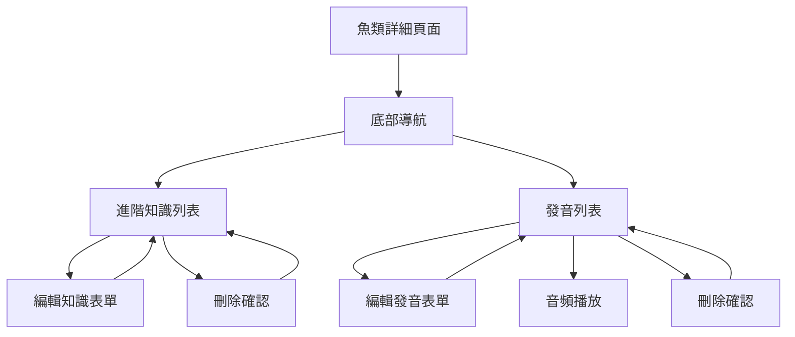

# Design Document

## Overview

本設計文件描述魚類圖鑑進階知識和發音列表管理功能的技術架構。系統將在現有的魚類詳細頁面基礎上，新增兩個完整的 CRUD 管理頁面，並整合到現有的底部導航系統中。設計遵循現有的 Laravel + Inertia.js + Vue.js 架構模式，並參考捕獲紀錄的實作方式。

## Architecture

### 系統架構層次

```
Frontend (Vue.js + Inertia.js)
├── Pages/
│   ├── FishKnowledgeList.vue      # 進階知識列表頁面
│   ├── FishAudioList.vue          # 發音列表頁面
│   ├── EditFishNote.vue           # 編輯進階知識頁面
│   └── EditFishAudio.vue          # 編輯發音頁面
├── Components/
│   ├── FishKnowledgeCard.vue      # 進階知識卡片組件
│   └── FishAudioCard.vue          # 發音卡片組件
└── Global/
    └── BottomNavBar.vue           # 更新底部導航

Backend (Laravel)
├── Controllers/
│   ├── FishNoteController.php     # 擴展現有控制器
│   └── FishAudioController.php    # 新增音頻控制器
├── Models/
│   ├── FishNote.php              # 現有模型
│   └── FishAudio.php             # 現有模型
└── Routes/
    └── web.php                   # 新增路由定義
```

### 資料流架構



## Components and Interfaces

### 前端組件設計

#### 1. FishKnowledgeList.vue

**功能：** 進階知識列表頁面
**設計模式：** 參考 CaptureRecords.vue

```vue
<template>
  <div class="container mx-auto p-4 relative">
    <!-- 魚類資訊區塊 -->
    <FishInfoHeader :fish="fish" :stats="knowledgeStats" />

    <!-- 知識分類列表 -->
    <div class="bg-white rounded-lg shadow-md p-4">
      <div v-for="category in groupedKnowledge" :key="category.name">
        <h4 class="font-semibold mb-3">{{ category.name }}</h4>
        <div class="space-y-3 mb-6">
          <FishKnowledgeCard
            v-for="note in category.notes"
            :key="note.id"
            :note="note"
            :fishId="fish.id"
            @updated="onNoteUpdated"
            @deleted="onNoteDeleted"
          />
        </div>
      </div>
    </div>

    <!-- FAB 按鈕 -->
    <FabButton label="新增知識" :to="`/fish/${fish.id}/create`" />

    <!-- 底部導航 -->
    <BottomNavBar :currentPage="'knowledgeList'" />
  </div>
</template>
```

#### 2. FishAudioList.vue

**功能：** 發音列表頁面
**設計模式：** 參考 CaptureRecords.vue

```vue
<template>
  <div class="container mx-auto p-4 relative">
    <!-- 魚類資訊區塊 -->
    <FishInfoHeader :fish="fish" :stats="audioStats" />

    <!-- 發音列表 -->
    <div class="bg-white rounded-lg shadow-md p-4">
      <div class="grid grid-cols-1 md:grid-cols-2 gap-4">
        <FishAudioCard
          v-for="audio in fish.audios"
          :key="audio.id"
          :audio="audio"
          :fishId="fish.id"
          :isPlaying="currentPlayingId === audio.id"
          @play="onAudioPlay"
          @updated="onAudioUpdated"
          @deleted="onAudioDeleted"
        />
      </div>
    </div>

    <!-- FAB 按鈕 -->
    <FabButton label="新增發音" :to="`/fish/${fish.id}/createAudio`" />

    <!-- 底部導航 -->
    <BottomNavBar :currentPage="'audioList'" />
  </div>
</template>
```

#### 3. FishKnowledgeCard.vue

**功能：** 進階知識卡片組件
**設計模式：** 參考 CaptureRecordCard.vue

```vue
<template>
  <div class="bg-gray-50 rounded-lg p-4 border">
    <div class="flex justify-between items-start mb-2">
      <span class="text-sm text-gray-500">{{ note.note_type || '一般知識' }}</span>
      <OverflowMenu>
        <MenuItem @click="editNote">編輯</MenuItem>
        <MenuItem @click="deleteNote" class="text-red-600">刪除</MenuItem>
      </OverflowMenu>
    </div>
    <p class="text-gray-800 mb-2">{{ note.note }}</p>
    <div class="text-xs text-gray-400">
      {{ formatDate(note.created_at) }}
    </div>
  </div>
</template>
```

#### 4. FishAudioCard.vue

**功能：** 發音卡片組件

```vue
<template>
  <div class="bg-gray-50 rounded-lg p-4 border">
    <div class="flex justify-between items-start mb-3">
      <h4 class="font-medium">{{ audio.name }}</h4>
      <OverflowMenu>
        <MenuItem @click="editAudio">編輯</MenuItem>
        <MenuItem @click="deleteAudio" class="text-red-600">刪除</MenuItem>
      </OverflowMenu>
    </div>

    <!-- 音頻播放控制 -->
    <div class="flex items-center gap-3 mb-3">
      <button
        @click="togglePlay"
        class="flex items-center justify-center w-10 h-10 bg-blue-500 text-white rounded-full hover:bg-blue-600"
      >
        <PlayIcon v-if="!isPlaying" />
        <PauseIcon v-else />
      </button>
      <div class="flex-1">
        <div class="text-sm text-gray-600">{{ audio.name }}</div>
        <div class="text-xs text-gray-400">點擊播放</div>
      </div>
    </div>

    <div class="text-xs text-gray-400">
      {{ formatDate(audio.created_at) }}
    </div>
  </div>
</template>
```

### 後端控制器設計

#### 1. FishNoteController 擴展

**新增方法：**

```php
// 進階知識列表頁面
public function knowledgeList($fishId)
{
    $fish = Fish::with('notes')->findOrFail($fishId);
    $fishWithImage = $this->fishService->assignImageUrls([$fish])[0];

    return Inertia::render('FishKnowledgeList', [
        'fish' => $fishWithImage,
        'groupedNotes' => $this->groupNotesByType($fish->notes)
    ]);
}

// 編輯知識頁面
public function editKnowledge($fishId, $noteId)
{
    $fish = Fish::findOrFail($fishId);
    $note = FishNote::where('fish_id', $fishId)->findOrFail($noteId);

    return Inertia::render('EditFishNote', [
        'fish' => $this->fishService->assignImageUrls([$fish])[0],
        'note' => $note,
        'noteTypes' => $this->getNoteTypes()
    ]);
}

// 按類型分組知識
private function groupNotesByType($notes)
{
    return $notes->groupBy('note_type')->map(function ($groupedNotes, $type) {
        return [
            'name' => $type ?: '一般知識',
            'notes' => $groupedNotes->sortBy('created_at')
        ];
    })->sortBy('name');
}
```

#### 2. FishAudioController 新增

**主要方法：**

```php
class FishAudioController extends Controller
{
    // 發音列表頁面
    public function audioList($fishId)
    {
        $fish = Fish::with('audios')->findOrFail($fishId);
        $fishWithImage = $this->fishService->assignImageUrls([$fish])[0];

        return Inertia::render('FishAudioList', [
            'fish' => $fishWithImage
        ]);
    }

    // 編輯發音頁面
    public function editAudio($fishId, $audioId)
    {
        $fish = Fish::findOrFail($fishId);
        $audio = FishAudio::where('fish_id', $fishId)->findOrFail($audioId);

        return Inertia::render('EditFishAudio', [
            'fish' => $this->fishService->assignImageUrls([$fish])[0],
            'audio' => $audio
        ]);
    }

    // 更新發音
    public function updateAudio(Request $request, $fishId, $audioId)
    {
        $audio = FishAudio::where('fish_id', $fishId)->findOrFail($audioId);

        $validated = $request->validate([
            'name' => 'required|string|max:255',
            'audio_filename' => 'nullable|string'
        ]);

        $updateData = ['name' => $validated['name']];

        if (!empty($validated['audio_filename'])) {
            // 處理音頻檔案更新
            $updateData['locate'] = $validated['audio_filename'];
        }

        $audio->update($updateData);

        return redirect()->route('fish.audio-list', $fishId);
    }

    // 刪除發音
    public function destroyAudio($fishId, $audioId)
    {
        $audio = FishAudio::where('fish_id', $fishId)->findOrFail($audioId);
        $audio->delete();

        return redirect()->route('fish.audio-list', $fishId);
    }
}
```

## Data Models

### 現有模型擴展

#### FishNote 模型

**現有欄位：**

- `fish_id` - 魚類 ID
- `note` - 知識內容
- `note_type` - 知識分類
- `locate` - 位置資訊

**新增功能：**

- 按 `note_type` 分組查詢
- 軟刪除支援

#### FishAudio 模型

**現有欄位：**

- `fish_id` - 魚類 ID
- `name` - 發音名稱
- `locate` - 音頻檔案路徑

**新增功能：**

- 音頻 URL 生成
- 軟刪除支援

### 資料關聯

```php
// Fish 模型中的關聯
public function notes(): HasMany
{
    return $this->hasMany(FishNote::class, 'fish_id');
}

public function audios(): HasMany
{
    return $this->hasMany(FishAudio::class, 'fish_id');
}

// 按類型分組的知識
public function notesByType()
{
    return $this->notes()->orderBy('note_type')->orderBy('created_at');
}
```

## Error Handling

### 前端錯誤處理

1. **音頻播放失敗**

   - 顯示友善錯誤訊息
   - 提供重試選項
   - 記錄錯誤日誌

2. **網路請求失敗**

   - 自動重試機制
   - 離線狀態提示
   - 資料同步恢復

3. **表單驗證錯誤**
   - 即時驗證回饋
   - 錯誤訊息本地化
   - 防止重複提交

### 後端錯誤處理

1. **資源不存在**

   ```php
   // 統一的 404 處理
   $fish = Fish::findOrFail($fishId);
   $note = FishNote::where('fish_id', $fishId)->findOrFail($noteId);
   ```

2. **檔案操作錯誤**

   ```php
   try {
       $this->supabaseStorage->delete($oldAudioPath);
   } catch (\Exception $e) {
       \Log::error('Failed to delete audio file: ' . $e->getMessage());
       // 不阻止主要操作繼續進行
   }
   ```

3. **資料庫操作錯誤**
   - 事務回滾機制
   - 錯誤日誌記錄
   - 使用者友善訊息

## Testing Strategy

### 前端測試

1. **組件單元測試**

   ```javascript
   // FishKnowledgeCard.spec.js
   describe('FishKnowledgeCard', () => {
     it('should display note content correctly', () => {
       // 測試知識內容顯示
     })

     it('should emit edit event when edit button clicked', () => {
       // 測試編輯事件
     })
   })
   ```

2. **音頻播放測試**
   ```javascript
   // FishAudioCard.spec.js
   describe('FishAudioCard', () => {
     it('should toggle play state when play button clicked', () => {
       // 測試播放狀態切換
     })
   })
   ```

### 後端測試

1. **控制器功能測試**

   ```php
   // FishAudioControllerTest.php
   public function test_can_view_audio_list()
   {
       $fish = Fish::factory()->create();
       $audio = FishAudio::factory()->create(['fish_id' => $fish->id]);

       $response = $this->get("/fish/{$fish->id}/audio-list");
       $response->assertStatus(200);
   }
   ```

2. **CRUD 操作測試**
   ```php
   public function test_can_update_audio()
   {
       $fish = Fish::factory()->create();
       $audio = FishAudio::factory()->create(['fish_id' => $fish->id]);

       $response = $this->put("/fish/{$fish->id}/audio/{$audio->id}", [
           'name' => 'Updated Audio Name'
       ]);

       $response->assertRedirect();
       $this->assertDatabaseHas('fish_audios', [
           'id' => $audio->id,
           'name' => 'Updated Audio Name'
       ]);
   }
   ```

### 整合測試

1. **端到端流程測試**

   - 從魚類詳細頁面導航到知識/發音列表
   - 完整的 CRUD 操作流程
   - 音頻播放功能測試

2. **跨瀏覽器相容性測試**
   - 音頻播放在不同瀏覽器的相容性
   - 響應式設計測試
   - 觸控裝置操作測試

## Navigation Integration

### 底部導航更新

```vue
<!-- BottomNavBar.vue 更新 -->
<template>
  <nav
    class="fixed bottom-0 left-0 right-0 z-50 border-t border-[#e7eff3] bg-slate-50 px-4 pb-3 pt-2 flex gap-2"
  >
    <!-- 現有導航項目 -->

    <!-- 新增進階知識連結 -->
    <a
      v-if="knowledgeList"
      :class="[
        'flex flex-1 flex-col items-center justify-end gap-1',
        currentPage === 'knowledgeList' ? 'text-[#0e171b]' : 'text-[#4d7f99]',
      ]"
      :href="knowledgeList"
    >
      <div class="flex h-8 items-center justify-center">
        <!-- Knowledge Icon -->
        <BookIcon />
      </div>
      <p class="text-xs font-medium">進階知識</p>
    </a>

    <!-- 新增發音列表連結 -->
    <a
      v-if="audioList"
      :class="[
        'flex flex-1 flex-col items-center justify-end gap-1',
        currentPage === 'audioList' ? 'text-[#0e171b]' : 'text-[#4d7f99]',
      ]"
      :href="audioList"
    >
      <div class="flex h-8 items-center justify-center">
        <!-- Audio Icon -->
        <VolumeIcon />
      </div>
      <p class="text-xs font-medium">發音列表</p>
    </a>
  </nav>
</template>
```

### 路由定義

```php
// web.php
Route::prefix('fish/{fish}')->group(function () {
    // 進階知識路由
    Route::get('/knowledge-list', [FishNoteController::class, 'knowledgeList'])->name('fish.knowledge-list');
    Route::get('/knowledge/{note}/edit', [FishNoteController::class, 'editKnowledge'])->name('fish.knowledge.edit');
    Route::put('/knowledge/{note}', [FishNoteController::class, 'updateKnowledge'])->name('fish.knowledge.update');
    Route::delete('/knowledge/{note}', [FishNoteController::class, 'destroyKnowledge'])->name('fish.knowledge.destroy');

    // 發音列表路由
    Route::get('/audio-list', [FishAudioController::class, 'audioList'])->name('fish.audio-list');
    Route::get('/audio/{audio}/edit', [FishAudioController::class, 'editAudio'])->name('fish.audio.edit');
    Route::put('/audio/{audio}', [FishAudioController::class, 'updateAudio'])->name('fish.audio.update');
    Route::delete('/audio/{audio}', [FishAudioController::class, 'destroyAudio'])->name('fish.audio.destroy');
});
```
