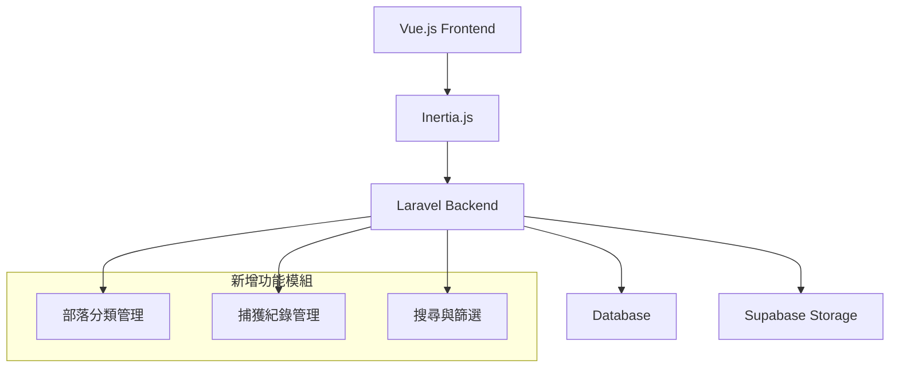
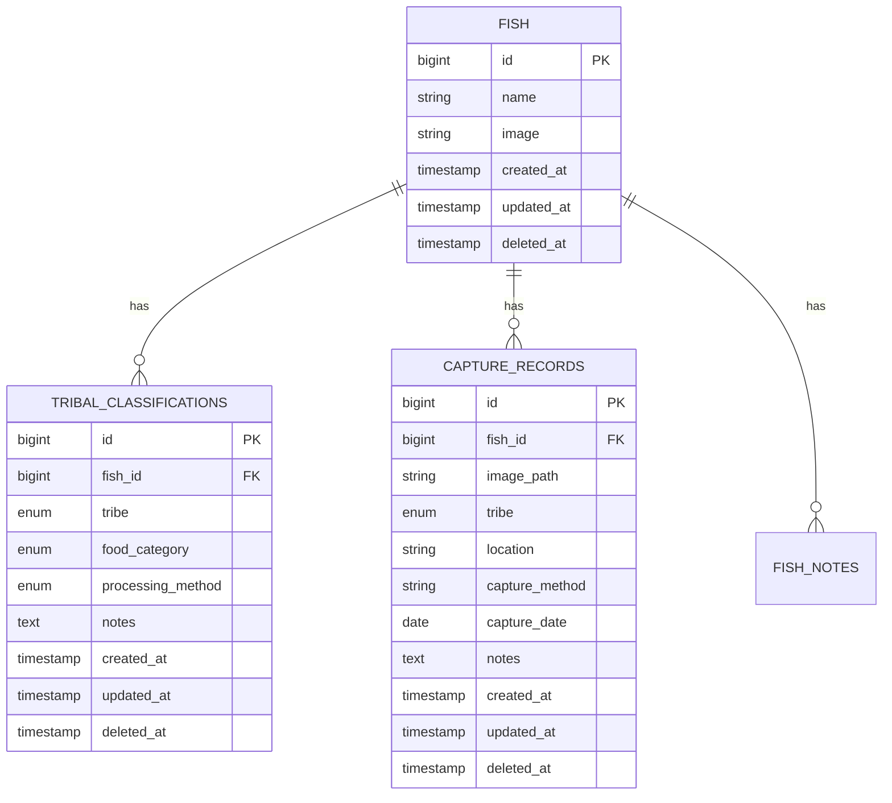

# 設計文檔

## 概述

本設計文檔描述了為現有魚類資料系統新增部落飲食分類與處理方式功能的技術實現方案。系統將擴展現有的 Laravel + Vue.js + Inertia.js 架構，新增部落文化資料管理、捕獲紀錄管理和相關的搜尋功能。

## 架構

### 技術棧

- **後端：** Laravel 11.x (PHP 8.2+)
- **前端：** Vue.js 3.x + Inertia.js 2.x
- **資料庫：** MySQL/PostgreSQL
- **檔案儲存：** Supabase Storage (現有)
- **樣式：** Tailwind CSS
- **測試：** Pest (PHP), Vitest (JavaScript)

### 系統架構圖



## 元件和介面

### 資料模型

#### 1. 擴展現有 Fish 模型

```php
// 新增關聯方法
public function tribalClassifications(): HasMany
public function captureRecords(): HasMany
```

#### 2. 新增 TribalClassification 模型

```php
class TribalClassification extends Model
{
    protected $fillable = [
        'fish_id',
        'tribe',           // ivalino, iranmeilek, imowrod, iratay, yayo, iraraley
        'food_category',   // oyod, rahet, 不分類, 不食用, ?, ''
        'processing_method', // 去魚鱗, 不去魚鱗, 剝皮, 不食用, ?, ''
        'notes'            // 調查備註（包含調查者、調查時間、調查過程等所有資訊）
    ];
}
```

#### 3. 新增 CaptureRecord 模型

```php
class CaptureRecord extends Model
{
    protected $fillable = [
        'fish_id',
        'image_path',      // 捕獲照片路徑
        'tribe',           // 捕獲部落 (ivalino, iranmeilek, imowrod, iratay, yayo, iraraley)
        'location',        // 捕獲地點
        'capture_method',  // 捕獲方式
        'capture_date',    // 捕獲日期
        'notes'            // 備註
    ];
}
```

### API 端點設計

#### 部落分類 API

```
GET    /api/fish/{id}/tribal-classifications     # 取得魚類部落分類
POST   /api/fish/{id}/tribal-classifications     # 新增部落分類
PUT    /api/tribal-classifications/{id}          # 更新部落分類
DELETE /api/tribal-classifications/{id}          # 刪除部落分類
POST   /api/fish/batch-update-tribal             # 批量更新部落分類
```

#### 捕獲紀錄 API

```
GET    /api/fish/{id}/capture-records            # 取得魚類捕獲紀錄
POST   /api/fish/{id}/capture-records            # 新增捕獲紀錄
PUT    /api/capture-records/{id}                 # 更新捕獲紀錄
DELETE /api/capture-records/{id}                 # 刪除捕獲紀錄
```

#### 搜尋 API

```
GET    /api/fish/search                          # 綜合搜尋
  ?tribe=iraraley
  &food_category=oyod
  &processing_method=去魚鱗
  &location=特定地點
```

### 前端元件架構

#### 頁面元件

```
pages/
├── Fish/
│   ├── Show.vue                    # 魚類詳細頁面 (擴展)
│   ├── Edit.vue                    # 魚類編輯頁面 (擴展)
│   ├── TribalClassifications.vue   # 部落分類管理頁面
│   ├── CaptureRecords.vue          # 捕獲紀錄頁面
│   └── Search.vue                  # 搜尋頁面 (擴展)
```

#### 資料填寫流程設計

**魚類部落資料填寫介面：**

1. **魚類編輯頁面擴展**

   - 在現有的魚類編輯頁面新增「部落資料」區塊
   - 提供新增部落分類的按鈕

2. **部落分類表單**

   - 部落選擇下拉選單（6個部落選項）
   - 飲食分類下拉選單（oyod, rahet, 不分類, 不食用, ?, ''）
   - 處理方式下拉選單（去魚鱗, 不去魚鱗, 剝皮, 不食用, ?, ''）
   - 調查備註文字區域（多行輸入）

3. **部落資料列表**
   - 顯示已填寫的部落資料
   - 每筆資料可編輯或刪除
   - 支援同一部落多筆不同觀點的記錄

**使用者操作流程：**

```
1. 進入魚類編輯頁面
2. 點擊「新增部落資料」按鈕
3. 選擇部落
4. 選擇飲食分類
5. 選擇處理方式
6. 填寫調查備註（調查者、時間、過程等）
7. 儲存部落資料
8. 重複步驟2-7為其他部落或同部落不同觀點新增資料
```

#### 共用元件

```
components/
├── TribalClassification/
│   ├── ClassificationForm.vue      # 部落分類表單
│   ├── ClassificationList.vue      # 部落分類列表
│   ├── ClassificationCard.vue      # 分類卡片
│   └── ComparisonView.vue          # 比較檢視
├── CaptureRecord/
│   ├── RecordForm.vue              # 捕獲紀錄表單
│   ├── RecordCard.vue              # 捕獲紀錄卡片
│   └── ImageUpload.vue             # 圖片上傳元件
└── Search/
    ├── FilterPanel.vue             # 篩選面板
    └── SearchResults.vue           # 搜尋結果
```

#### 表單設計詳細說明

**ClassificationForm.vue 元件設計：**

```vue
<template>
  <form @submit.prevent="submitForm">
    <!-- 部落選擇 -->
    <div class="form-group">
      <label>部落</label>
      <select v-model="form.tribe" required>
        <option value="">請選擇部落</option>
        <option value="ivalino">ivalino</option>
        <option value="iranmeilek">iranmeilek</option>
        <option value="imowrod">imowrod</option>
        <option value="iratay">iratay</option>
        <option value="yayo">yayo</option>
        <option value="iraraley">iraraley</option>
      </select>
    </div>

    <!-- 飲食分類選擇 -->
    <div class="form-group">
      <label>飲食分類</label>
      <select v-model="form.food_category">
        <option value="">尚未紀錄</option>
        <option value="oyod">oyod</option>
        <option value="rahet">rahet</option>
        <option value="不分類">不分類</option>
        <option value="不食用">不食用</option>
        <option value="?">?（不確定）</option>
      </select>
    </div>

    <!-- 處理方式選擇 -->
    <div class="form-group">
      <label>處理方式</label>
      <select v-model="form.processing_method">
        <option value="">尚未紀錄</option>
        <option value="去魚鱗">去魚鱗</option>
        <option value="不去魚鱗">不去魚鱗</option>
        <option value="剝皮">剝皮</option>
        <option value="不食用">不食用</option>
        <option value="?">?（不確定）</option>
      </select>
    </div>

    <!-- 調查備註 -->
    <div class="form-group">
      <label>調查備註</label>
      <textarea
        v-model="form.notes"
        rows="4"
        placeholder="請記錄調查者、調查時間、調查過程、不同觀點等資訊"
      ></textarea>
    </div>

    <button type="submit">儲存部落資料</button>
  </form>
</template>
```

**ClassificationList.vue 元件設計：**

- 顯示該魚類所有部落分類資料
- 每筆資料顯示：部落名稱、飲食分類、處理方式、備註摘要
- 提供編輯和刪除按鈕
- 支援展開/收合備註詳細內容

## 資料模型

### 資料庫結構

#### tribal_classifications 表

```sql
CREATE TABLE tribal_classifications (
    id BIGINT UNSIGNED AUTO_INCREMENT PRIMARY KEY,
    fish_id BIGINT UNSIGNED NOT NULL,
    tribe ENUM('ivalino', 'iranmeilek', 'imowrod', 'iratay', 'yayo', 'iraraley') NOT NULL,
    food_category ENUM('oyod', 'rahet', '不分類', '不食用', '?', '') DEFAULT '',
    processing_method ENUM('去魚鱗', '不去魚鱗', '剝皮', '不食用', '?', '') DEFAULT '',
    notes TEXT NULL,
    created_at TIMESTAMP NULL,
    updated_at TIMESTAMP NULL,
    deleted_at TIMESTAMP NULL,

    FOREIGN KEY (fish_id) REFERENCES fish(id) ON DELETE CASCADE,
    UNIQUE KEY unique_fish_tribe (fish_id, tribe)
);
```

#### capture_records 表

```sql
CREATE TABLE capture_records (
    id BIGINT UNSIGNED AUTO_INCREMENT PRIMARY KEY,
    fish_id BIGINT UNSIGNED NOT NULL,
    image_path VARCHAR(500) NOT NULL,
    tribe ENUM('ivalino', 'iranmeilek', 'imowrod', 'iratay', 'yayo', 'iraraley') NOT NULL,
    location VARCHAR(255) NOT NULL,
    capture_method VARCHAR(255) NOT NULL,
    capture_date DATE NOT NULL,
    notes TEXT NULL,
    created_at TIMESTAMP NULL,
    updated_at TIMESTAMP NULL,
    deleted_at TIMESTAMP NULL,

    FOREIGN KEY (fish_id) REFERENCES fish(id) ON DELETE CASCADE
);
```

### 資料關聯



## 錯誤處理

### API 錯誤回應格式

```json
{
  "message": "錯誤訊息",
  "errors": {
    "field_name": ["具體錯誤描述"]
  },
  "code": "ERROR_CODE"
}
```

### 常見錯誤處理

- **404 Not Found:** 魚類或記錄不存在
- **422 Validation Error:** 表單驗證失敗
- **409 Conflict:** 重複的部落分類記錄
- **413 Payload Too Large:** 上傳檔案過大
- **500 Internal Server Error:** 伺服器內部錯誤

### 前端錯誤處理

- 使用 try-catch 包裝 API 呼叫
- 顯示使用者友善的錯誤訊息
- 提供重試機制
- 記錄錯誤到控制台供除錯使用

## 測試策略

### 後端測試

#### 單元測試

- 模型關聯測試
- 驗證規則測試
- 服務類別邏輯測試

#### 功能測試

- API 端點測試
- 資料庫操作測試
- 檔案上傳測試

#### 測試範例

```php
// tests/Feature/TribalClassificationTest.php
test('can create tribal classification', function () {
    $fish = Fish::factory()->create();

    $response = $this->postJson("/api/fish/{$fish->id}/tribal-classifications", [
        'tribe' => 'iraraley',
        'food_category' => 'oyod',
        'processing_method' => '去魚鱗',
        'notes' => '測試備註'
    ]);

    $response->assertStatus(201);
    $this->assertDatabaseHas('tribal_classifications', [
        'fish_id' => $fish->id,
        'tribe' => 'iraraley'
    ]);
});
```

### 前端測試

#### 元件測試

- Vue 元件渲染測試
- 使用者互動測試
- Props 和 Events 測試

#### 整合測試

- 頁面流程測試
- API 整合測試

#### 測試範例

```javascript
// tests/components/ClassificationForm.test.js
import { mount } from '@vue/test-utils'
import ClassificationForm from '@/components/TribalClassification/ClassificationForm.vue'

test('renders classification form correctly', () => {
  const wrapper = mount(ClassificationForm, {
    props: {
      tribes: ['iraraley', 'imowrod'],
      foodCategories: ['oyod', 'rahet', '不分類'],
    },
  })

  expect(wrapper.find('select[name="tribe"]').exists()).toBe(true)
  expect(wrapper.find('select[name="food_category"]').exists()).toBe(true)
})
```

## 效能考量

### 資料庫最佳化

- 在 `fish_id`, `tribe` 欄位建立索引
- 在搜尋常用欄位建立複合索引
- 使用軟刪除避免資料遺失

### 快取策略

- 快取常用的搜尋結果
- 快取部落和分類選項列表
- 使用 Redis 進行快取管理

### 圖片最佳化

- 圖片壓縮和格式轉換
- 使用 CDN 加速圖片載入
- 實作圖片懶載入

### 前端效能

- 使用 Vue 3 的 Composition API
- 實作虛擬滾動處理大量資料
- 使用防抖動處理搜尋輸入

## 安全性考量

### 資料驗證

- 後端嚴格驗證所有輸入資料
- 前端提供即時驗證回饋
- 防止 SQL 注入和 XSS 攻擊

### 檔案上傳安全

- 限制檔案類型和大小
- 檔案名稱消毒處理
- 病毒掃描 (如需要)

### 權限控制

- 實作角色基礎的存取控制
- API 端點權限驗證
- 資料擁有者權限檢查

## 部署考量

### 資料庫遷移

- 建立新資料表的遷移檔案
- 提供回滾機制
- 資料遷移腳本

### 環境配置

- 新增必要的環境變數
- 更新 Supabase 儲存桶設定
- 設定檔案上傳限制

### 監控和日誌

- API 效能監控
- 錯誤日誌記錄
- 使用者行為追蹤
